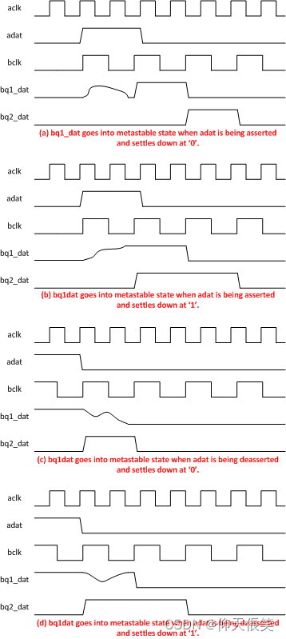

* 当触发器的输入端数据，在*建立时间*之后和*保持时间*之前跳变时，就会引起亚稳态。
  * 亚稳态的表现是，触发器的数据输出端不断震荡，不是稳定的电平。在一段时间之后，输出电平稳定，但是该输出不一定与输入相同。
* 可采用打2拍的方式改善亚稳态问题：
  * 第一级寄存器发生亚稳态之后稳定的概率为70%，即该寄存器输出端的震荡在下一个时钟上升沿到来之前消失的概率为70％。
  * 再串联一级寄存器，则二级寄存器输出稳定的概率为99％。
  * 参考“[跨时钟域同步，为什么两级寄存器结构能够降低亚稳态?](https://www.zhihu.com/question/43571892)”
* 需要注意的是，打两拍的方式只能尽可能地避免亚稳态进一步向后级电路传播，而无法保证数据传播的正确性，如下图：
  * 因此，打两拍以改善亚稳态的方式只适用于：
    * 脉冲信号（但必须保持2T）。
    * 慢时钟域到快时钟域的信号（如UART的RX输入信号）。
* 
  

---
## 学习资料
1. [【Chips】跨时钟域的亚稳态处理、为什么要打两拍不是打一拍、为什么打两拍能有效？](https://blog.csdn.net/Hide_in_Code/article/details/126600563)
2. [数字IC/FPGA面试常考问题------亚稳态中，为什么打两拍可以消除亚稳态的影响](https://blog.csdn.net/weixin_42279450/article/details/124199039)
3. [亚稳态专题（亚稳态的概念、亚稳态的产生、亚稳态的后果、以及如何避免亚稳态）](https://blog.csdn.net/CLL_caicai/article/details/104625791)