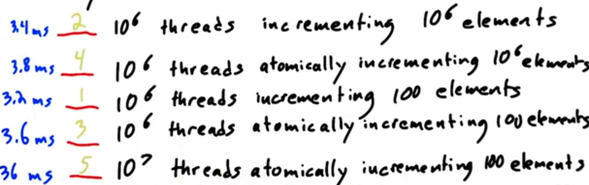

<!-- GFM-TOC -->
- [基本常识](#基本常识)
- [典型的GPU编程模型](#典型的gpu编程模型)
- [GPU的并行通信模式](#gpu的并行通信模式)
- [Streaming Multiprocessors](#streaming-multiprocessors)
- [内存](#内存)
- [GPU的同步技术](#gpu的同步技术)
- [math/memory](#mathmemory)
- [GPU程序优化](#gpu程序优化)
<!-- GFM-TOC -->
---

### 基本常识
1. 相比较于`latency`，GPU设计者更看重`throughput`来提升性能。
    * GPU内部集成了性能较低但是数量很多的核心。
2. CPU是`host`，GPU是`device`。
3. GPU上运行并行运算的程序被称为`kernel`。
4. `thread` ⊂ `block` ⊂ `grid`

   
### 典型的GPU编程模型
  * CPU为GPU`malloc`内存。
    * 这些内存从GPU自己的`memory`当中分配。
  * CPU将原始数据传输给GPU。
  * CPU`call`特定的`kernel`来处理数据。
  * CPU从GPU那接收处理好的数据。
   
### GPU的并行通信模式
  1. map
    * 一对一
  2. gather
    * 多对一
  3. scatter
    * 一对多
  4. stencil
    * 输入是输出位置的邻居
    * 要求每个线程都严格执行相同的模板
  5. transpose
    * 转置，一般也是一对一
    * 要求每个线程都严格执行相同的转换

### Streaming Multiprocessors
   * 每一个SM都有自己的控制单元、寄存器、缓存、指令流水线。
   * 一个block只能运行在一个SM上；但是一个SM可能同时运行多个blocks。
     * 一个block上的所有threads可以**互相协同**，但是thread不能跨block来**协同**。
   * 在kernel2开始运行前，所有运行kernel1的blocks必须都要运行完成([GPU的同步技术](#gpu的同步技术))。
   * SM无法保证运行同一个kernel的threads当中哪一个thread先运行完成。
   * [NVIDIA GPU- 流式多处理器（Streaming Multiprocessor）](https://blog.csdn.net/weixin_43844521/article/details/133906144)
   * [CUDA学习笔记07：SM + SP + Grid + Block + Thread 关系](https://blog.csdn.net/JackZhang_123/article/details/78147197)
   * [AI 工程师都应该知道的GPU工作原理，TensorCore](https://www.bilibili.com/video/BV1rH4y1c7Zs/?spm_id_from=333.1007.top_right_bar_window_default_collection.content.click&vd_source=d791a57f43dad7ca6a1d62950cab7001)

### 内存
   1. GPU当中的内存主要有`local/shared/global memory`
      * `local memory`是每个thread私有的内存       
      * `shared memory`是同一个block当中的所有thread分享的内存       
      * `global memory`是所有thread共用的内存，是GPU显存(HBM)的组成部分之一。      
      * `host memory`是CPU使用的内存     
   2. **Access Speed** : local > shared >> global >> host(CPU) memory
   3. 传入kernel的参数变量位于`local memory`；指针参数指向的数据位于`global memory`。

### GPU的同步技术
   * GPU同步——**barrier**
     * `__syncthreads()`
     * 使所有线程可以**安全地共享内存**。
     * 实际上，每个kernel之间存在一个隐形的barrier —— 与[Streaming Multiprocessors](#streaming-multiprocessors)第三点对应了起来。
     * 每一个**shared memory的读/写操作前后**都应考虑要不要加barrier。
  

### math/memory
  1. 减小分母
     1. 提升**Access Speed**
         1. 多使用 local memory 或者 shared memory。
         2. Coalesce —— 编写kernel的代码，使GPU总是连续地访问**全局内存**。
            * 硬件上，GPU访问global memory时，哪怕只访问一个单位的内存，实际上会访问该包含该单位的附近的一大块内存。
            * 与coalesce访存相对应的就是`stride`访存。
            * 当多个threads运行相同的代码并行访问global memory时，相邻thread访问的内存距离越小，越是好的coalescing。
              * 一个坏的coalescing例子就是矩阵转置kernal(intro unit 5)。
            * [CUDA 编程之 Memory Coalescing](https://zhuanlan.zhihu.com/p/300785893)
         3. 利用pinned memory（host memory）。
         4. atomic memory operation
      2. 避免**Thread Divergence**线程分歧多产生于分支和循环。
         1. 线程分歧会影响wrap中的thread的执行效率。猜测这是因为GPU也存在指令流水线，而同一wrap中的32个threads执行相同的指令，当出现线程分歧时指令流水线会插入气泡，从而降低执行效率。
         2. 一般来说，wrap对于分支分歧的处理是每个线程都执行每个分支，然后根据分支条件选择对应分支的结果。
            * 这样既增加了运行时间，又增加了运行功耗。
            * Nvidia的GPU对于分支分歧的解决方法是：让符合分支条件的线程去执行该分支，与此同时其它线程阻塞。    这种情况下虽然运行时间没有减少，但是运行功耗大大减少。
  2. 增大分子
    

### GPU程序优化
1. ‌Amdahl's law
   * 优先优化时间占比最长的代码块。
2. [CUDA相关 | 如何安装deviceQuery](https://zhuanlan.zhihu.com/p/666647168)
   * 可以利用它知晓很多GPU的信息。
   * `Theoretical peak bandwidth` = memory clock rate * memory bus rate
     * 可以根据代码的数据运输和kernal运行时间粗略估计实际的内存带宽，它至少应该达到**理论峰值的40%**。
   * `Dram Utilization`
3. [CUDA编程 - Nsight system & Nsight compute 的安装和使用 - 学习记录](https://blog.csdn.net/weixin_40653140/article/details/136238420)
4. Tiling技术
   * 当无法避免地出现坏coalescing时，分块可以一定程度上减少坏coalescing，缩短访问全局内存的时间。
   * [The CUDA Parallel Programming Model - 7.Tiling](https://nichijou.co/cuda7-tiling/)
   * [Cuda 编程之 Tiling](https://zhuanlan.zhihu.com/p/342103911)
5. Occupancy
   * 影响occupancy的因素有：blocks/SM、thread/SM、registers/thread、shared memory/block等
   * 并非occupancy越高，程序越好。occupancy过高意味着程序受到了硬件资源的限制，无法充分并行。
6. Thread Diverge
   * 对于同一个warp内的threads来说，最大减速比为32。
7. 利用stream进行异步操作
   * 不同的stream之间异步，同一个stream内同步。
8. 使用host memory中的pinned memory
   * [CUDA 之 Pinned Memory](https://www.jianshu.com/p/e92e72c0ba51)
   * [CUDA:页锁定内存(pinned memory)和按页分配内存(pageable memory )](https://www.cnblogs.com/whiteBear/p/17842246.html)

* 计算掩盖访存
  * GPU显存的延迟非常大，如果cuda core一直等待访存会严重浪费性能。
  * 当一些wrap在等待访存结束时，wrap调度器会激活其它wrap来执行，如此反复，充分利用硬件性能。
  * 因此GPU可以运行的线程数可以大于核数。
  * 这一特性也使GPU需要的cache容量减小，降低了功耗
  

cudamemory api-p282
CPU上都是异步的，但是同一个stream中，GPU会排队
需要注意GPU可能没有足够的资源完成不同stream中的GPU操作

  