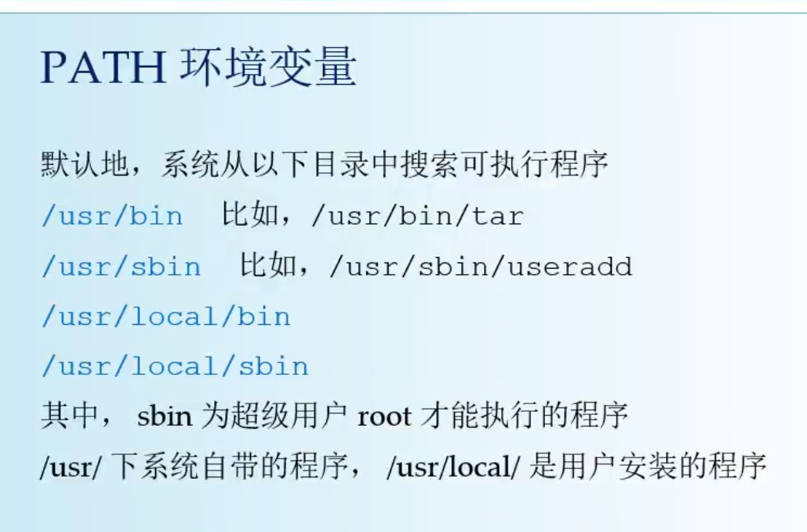
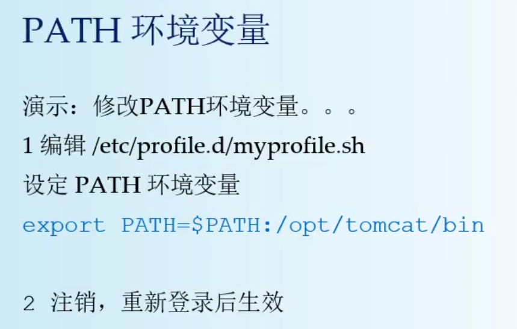

<!-- GFM-TOC -->
- [脚本执行](#脚本执行)
- [变量](#变量)
- [子程序与父程序](#子程序与父程序)
- [其他](#其他)
- [学习资料](#学习资料)
<!-- GFM-TOC -->
---

## 脚本执行
1. 在`子程序`中执行

   * 直接命令下达:xx.sh 文件必须具备可读和可执行(`rx`)权限，然后：
     * 绝对路径：使用`/home/uae/xx.sh`来下达指令;
     * 相对路径：假设工作目录在`/home/uae/`，则使用`./xx.sh`来执行
     * 变量`PATH`功能：将 `xx.sh` 移动到 `PATH` 指定的目录内，例如：`~/bin/`
   * 以 bash 程序来执行：通过`bash xx.sh`或`sh x.sh`来执行
       * 使用`sh xx.sh`亦即告诉系统，我想要直接以 bash 的功能来执行 xx.sh 这个文件内的相关指令，所以此时 xx.sh 只要有 `r` 的权限即可被执行！ 
  
    这两种方式下 script 是在子程序的bash内执行的。当子程序完成后，在子程序内的各项变量或动作将会结束而不会传回到父程序中。

2. 在`父程序`中执行
    
    利用`source`来执行脚本：在父程序中执行
---

## 变量
1. 扩增变量
   
    为扩增变量内容时，则可用`“$变量名”` 或 `${变量}`累加内容，如下所示：
    ```bash
    PATH=“$PATH”：/home/bin  or  PATH=${PATH}：/home/bin
    ```
2. 取消变量

   取消变量的方法为使用`unset`，例如取消 myname 的设置：
    ```bash
    unset myname
    ```
3. `export`将自定变量转成环境变量
   
    如果某自定义变量需要在其它子程序执行，需要以`export`来使变量变成环境变量：
    ```bash
    export var
    ```
4. `$()`
   
    在一串指令的执行中，还需要借由其他额外的指令所提供的信息时，可以使用`反单引号'指令'`或`$（指令)`。  例如想要取得核心版本的设置：
    ```bash
    $ version=$（uname -r）
    $ echo $version
    3.10.0-229.el7.x86_64
    ```
5. 环境变量

   * **用户**环境变量对**当前用户的所有终端有效**，定义在脚本文件`～/.profile`中
     * 每次打开终端后，会自动运行脚本文件`～/.profile`。      
     * 每个用户都有自己的`.profile`
   * **系统**环境变量对**所有用户**有效，定义在脚本文件`/etc/profile`中
     * 每次打开系统后，会自动运行脚本文件`/etc/profile`，该脚本文件遍历`/etc/profile.d/`目录下的所有脚本，
     * 一般用户在`/etc/profile.d/`目录下新建一个脚本文件，并在其中创建**系统环境变量**。
  <div align="center">  
  </div><div align="center">  </div>

---

## 子程序与父程序
1. 子程序仅会继承父程序的**环境变量**，不会继承父程序的**自定变数**。当子程序完成后，在子程序内的各项变量或动作将会结束而不会传回到父程序中。
   
2. 为什么环境变量的资料可以被子程序所引用呢？ 这是因为内存配置的关系：
   >* 当启动一个shell，操作系统会分配一记忆区块给shell使用，此内存内之变量可让子程序取用；
   >* 若在父程序利用 export 功能，可以让自定义变量的内容写到上述的记忆区块当中（环境变量）；
   >* 当载入另一个shell时（亦即启动子程序，而离开原本的父程序了），子 shell 可以将父shell的环境变量所在的记忆区块导入自己的环境变量区块当中。
  
3. 利用`source`来执行脚本，可以让该脚本在**父程序**中执行

4. `exit`
   
   使用`exit 0`，这代表离开 script 并且回传一个 `0` 给系统。
   
   利用这个 `exit n`的功能，我们还可以自定义错误讯息， 让这支程序变得更加smart。
---

## 其他
1. 脚本程序由解释器执行。`bash shell`脚本解释器目录：`/bin/sh`
   
2. 利用`source`或`小数点（.）`都可以将配置文件的内容读进来目前的 shell环境中！ 举例来说，我修改了 ~/.bashrc ，那么不需要注销，立即`source ~/.bashrc`就可以将刚刚最新设定的内容读进来目前的环境中！ 

3. 双括号结构
   
   `（（表达式））`用来扩展Shell中的`算术运算`，以及`赋值运算`，`扩展for、while、if条件测试运算`。在双括号结构中，所有变量可以不加入`$`符号前缀，也可以加入三。
   
4. 指令太长的时候，可以使用`反斜线\`来跳脱`Enter`符号，使指令连续到下一行。至于如果一行的内容太多，则可以使用`Enter`来延伸至下一行。
---

## 学习资料
1. [《鸟哥私房菜》第十二章](https://linux.vbird.org/linux_basic/centos7/0340bashshell-scripts.php#debug)
2. [《Linux C编程一站式学习》p31](https://www.bookstack.cn/read/linux-c/7e282745c3758a17.md)
3. [中科大Linux101 - 六](https://101.ustclug.org/Ch06/#bash-special-tokens)
4. [MIT教程 - 《Shell 工具和脚本》](https://missing-semester-cn.github.io/2020/shell-tools/)


