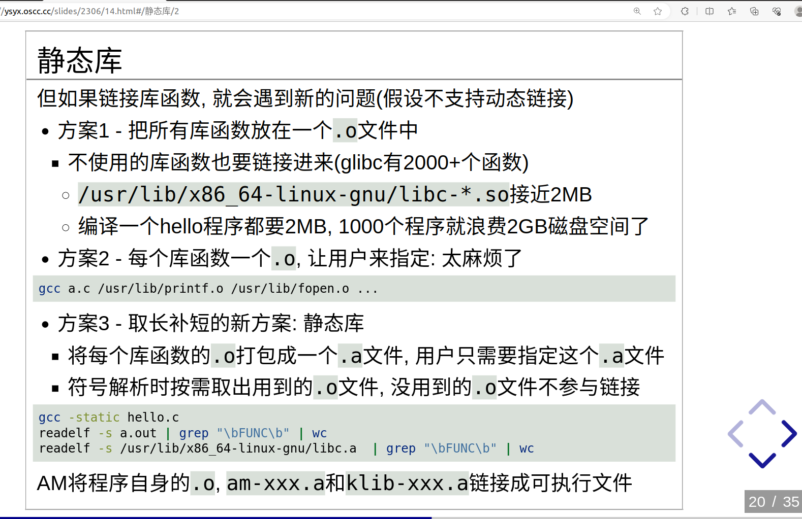

<!-- GFM-TOC -->
- [目标文件](#目标文件)
- [ELF Header](#elf-header)
- [Section Headers Table](#section-headers-table)
- [Program Headers Table](#program-headers-table)
- [section和segmet的区别](#section和segmet的区别)
- [`.strtab`](#strtab)
- [静态库(.a)](#静态库a)
- [学习资料](#学习资料)
<!-- GFM-TOC -->

---


## 目标文件
- `可重定位目标文件（.o）`：包含二进制代码和数据，其形式可以和其他目标文件进行合并，创建一个可执行目标文件。
- `可执行目标文件（.out）`：包含二进制代码和数据，可直接被加载器加载执行。
- `共享目标文件（.so）`：可被动态的加载和链接（暂时不讨论）。


## ELF Header
```
ELF Header:
  Magic:   7f 45 4c 46 01 01 01 00 00 00 00 00 00 00 00 00 
  Class:                             ELF32
  Data:                              2's complement, little endian
  Version:                           1 (current)
  OS/ABI:                            UNIX - System V
  ABI Version:                       0
  Type:                              EXEC (Executable file)
  Machine:                           RISC-V
  Version:                           0x1
  Entry point address:               0x80000000
  Start of program headers:          52 (bytes into file)
  Start of section headers:          5616 (bytes into file)
  Flags:                             0x0
  Size of this header:               52 (bytes)
  Size of program headers:           32 (bytes)
  Number of program headers:         3
  Size of section headers:           40 (bytes)
  Number of section headers:         10
  Section header string table index: 9
```
- `ELF Header`描述了体系结构和操作系统等基本信息，并指出`Section Header Table`和`Program Header Tabl`e在文件中的什么位置.


## Section Headers Table
```
Section Headers:
  [Nr] Name              Type            Addr     Off    Size   ES Flg Lk Inf Al
  [ 0]                   NULL            00000000 000000 000000 00      0   0  0
  [ 1] .text             PROGBITS        80000000 001000 000128 00  AX  0   0  4
  [ 2] .srodata.mainargs PROGBITS        80000128 001128 000001 00   A  0   0  4
  [ 3] .data.ans         PROGBITS        8000012c 00112c 000100 00  WA  0   0  4
  [ 4] .data.test_data   PROGBITS        8000022c 00122c 000020 00  WA  0   0  4
  [ 5] .comment          PROGBITS        00000000 00124c 00000f 01  MS  0   0  1
  [ 6] .riscv.attributes RISCV_ATTRIBUTE 00000000 00125b 000033 00      0   0  1
  [ 7] .symtab           SYMTAB          00000000 001290 000230 10      8  16  4
  [ 8] .strtab           STRTAB          00000000 0014c0 0000c5 00      0   0  1
  [ 9] .shstrtab         STRTAB          00000000 001585 000068 00      0   0  1
Key to Flags:
  W (write), A (alloc), X (execute), M (merge), S (strings), I (info),
  L (link order), O (extra OS processing required), G (group), T (TLS),
  C (compressed), x (unknown), o (OS specific), E (exclude),
  D (mbind), p (processor specific)

There are no section groups in this file.
```
- `Section Header Table`中保存了所有Section的描述信息,在加载执行过程中没有用到，所以是可有可无的。
- `flg`选项描述了该section的读写等权限。
- 在汇编程序中用`.section`声明的`Section`会成为目标文件中的`Section`，此外汇编器还会自动添加一些`Section`（比如符号表）。
- `.txt`节存放的是指令，`.data`存放的是可写数据，`.bss`存放的是未初始化数据。
- C语言的全局变量如果在代码中没有初始化，就会在程序加载时用0初始化。这种数据属于`.bss`节，在加载时它和`.data`节一样都是可读可写的数据，但是在ELF文件中`.data`节需要占用一部分空间保存初始值，而`.bss`节则不需要。也就是说，`.bss`节在elf文件中只占一个`Section Header`而没有对应的`Section`，程序加载时.bss节占多大内存空间在`Section Header`中描述。
- `.shstrtab`中保存着各`Section`的名字，`.strtab`中保存着程序中用到的符号的名字。每个名字都是以'\0'结尾的字符串。


## Program Headers Table
```
Program Headers:
  Type           Offset   VirtAddr   PhysAddr   FileSiz MemSiz  Flg Align
  RISCV_ATTRIBUT 0x00125b 0x00000000 0x00000000 0x00033 0x00000 R   0x1
  LOAD           0x001000 0x80000000 0x80000000 0x00129 0x00129 R E 0x1000
  LOAD           0x00112c 0x8000012c 0x8000012c 0x00120 0x00120 RW  0x1000
```
- `Program Header Table`中保存了所有Segment的描述信息,在汇编和链接过程中没有用到，所以是可有可无的.


## section和segmet的区别
```
 Section to Segment mapping:
  Segment Sections...
   00     .riscv.attributes 
   01     .text .srodata.mainargs 
   02     .data.ans .data.test_data 

There is no dynamic section in this file.
There are no relocations in this file.
The decoding of unwind sections for machine type RISC-V is not currently supported.
```
- `sections`是从**链接**的角度来描述elf文件，在运行阶段可以忽略`section header table`。
- `segment`是从**运行**的角度来描述elf文件，在链接阶段可以忽略`program header table`。
- 
- 在**汇编器和链接器**看来，ELF文件是由`Section Header Table`描述的一系列`Section`的集合，而执行一个ELF文件时，在**加载器（Loader）** 看来它是由`Program Header Table`描述的一系列`Segment`的集合.
- `segments`与`sections`是包含的关系：`Segment`是指在程序运行时加载到内存的具有相同属性的区域，由一个或多个`Section`组成，比如有两个`Section`都要求加载到内存后可读可写，就属于同一个`Segment`。有些`Section`只对汇编器和链接器有意义，在运行时用不到，也不需要加载到内存，那么就不属于任何`Segment`（如`symtab`）。


## `.strtab`
```
Symbol table '.symtab' contains 35 entries:
   Num:    Value  Size Type    Bind   Vis      Ndx Name
     0: 00000000     0 NOTYPE  LOCAL  DEFAULT  UND 
     1: 80000000     0 SECTION LOCAL  DEFAULT    1 .text
     2: 80000128     0 SECTION LOCAL  DEFAULT    2 .srodata.mainargs
     3: 8000012c     0 SECTION LOCAL  DEFAULT    3 .data.ans
     4: 8000022c     0 SECTION LOCAL  DEFAULT    4 .data.test_data
     5: 00000000     0 SECTION LOCAL  DEFAULT    5 .comment
     6: 00000000     0 SECTION LOCAL  DEFAULT    6 .riscv.attributes
     7: 00000000     0 FILE    LOCAL  DEFAULT  ABS start.o
     8: 80000000     0 NOTYPE  LOCAL  DEFAULT    1 $xrv32i2p1_m2p0_[...]
     9: 00000000     0 FILE    LOCAL  DEFAULT  ABS add.c
    10: 80000010     0 NOTYPE  LOCAL  DEFAULT    1 $  [...]
    11: 80000028     0 NOTYPE  LOCAL  DEFAULT    1 $xrv32i2p1_m2p0_[...]
    12: 00000000     0 FILE    LOCAL  DEFAULT  ABS trm.c
    13: 800000fc     0 NOTYPE  LOCAL  DEFAULT    1 $xrv32i2p1_m2p0_[...]
    14: 80000108     0 NOTYPE  LOCAL  DEFAULT    1 $xrv32i2p1_m2p0_[...]
    15: 80000128     1 OBJECT  LOCAL  DEFAULT    2 mainargs
    16: 80000108    32 FUNC    GLOBAL HIDDEN     1 _trm_init
    17: 80009000     0 NOTYPE  GLOBAL DEFAULT    4 _stack_pointer
    18: 80000128     0 NOTYPE  GLOBAL DEFAULT    1 _etext
    19: 80000000     0 NOTYPE  GLOBAL DEFAULT  ABS _pmem_start
    20: 8000024c     0 NOTYPE  GLOBAL DEFAULT    4 _bss_start
    21: 80000129     0 NOTYPE  GLOBAL DEFAULT    2 edata
    22: 80009000     0 NOTYPE  GLOBAL DEFAULT    4 _heap_start
    23: 80001000     0 NOTYPE  GLOBAL DEFAULT    4 _stack_top
    24: 80009000     0 NOTYPE  GLOBAL DEFAULT    4 end
    25: 80000010    24 FUNC    GLOBAL HIDDEN     1 check
    26: 80000128     0 NOTYPE  GLOBAL DEFAULT    1 etext
    27: 80000000     0 FUNC    GLOBAL DEFAULT    1 _start
    28: 00000000     0 NOTYPE  GLOBAL DEFAULT  ABS _entry_offset
    29: 80000028   212 FUNC    GLOBAL HIDDEN     1 main
    30: 80000129     0 NOTYPE  GLOBAL DEFAULT    2 _data
    31: 8000012c   256 OBJECT  GLOBAL HIDDEN     3 ans
    32: 80009000     0 NOTYPE  GLOBAL DEFAULT    4 _end
    33: 800000fc    12 FUNC    GLOBAL HIDDEN     1 halt
    34: 8000022c    32 OBJECT  GLOBAL HIDDEN     4 test_data
```
- `size`选项的数据为十进制，与`Section Headers Table`中的十六进制`size`不同。
- `Ndx`选项指代的是该`symbol`位于`Section Headers Table`中的`section`编号。
  - `UND`代表在该目标文件当中未找到该`symbol`的定义。
- `Type`选项指代的是该`symbol`的属性。
  - `SECTION`代表该`symbol`是一个节。
  - `FUNC`代表该`symbol`是一个函数。
  - `OBJECT`代表该`symbol`是一个变量。


## 静态库(.a)
- 链接脚本(.ld)中定义的符号可以被C程序和汇编程序中调用。
  - 如`$AM_HOME/am/src/platform/nemu/trm.c`中的`extern char _heap_start`。
  - 如`$AM_HOME/am/src/riscv/nemu/start.S`中的`la sp, _stack_pointer`。
  - `_heap_start`和`_stack_pointer`均在`$AM_HOME/scripts/linker.ld`中被定义。
  
- <div align="center">  


## 学习资料
1. [ELF文件格式解析器 原理 + 代码](https://zhuanlan.zhihu.com/p/147322084)
2. [ELF文件详解—初步认识](https://blog.csdn.net/daide2012/article/details/73065204)
