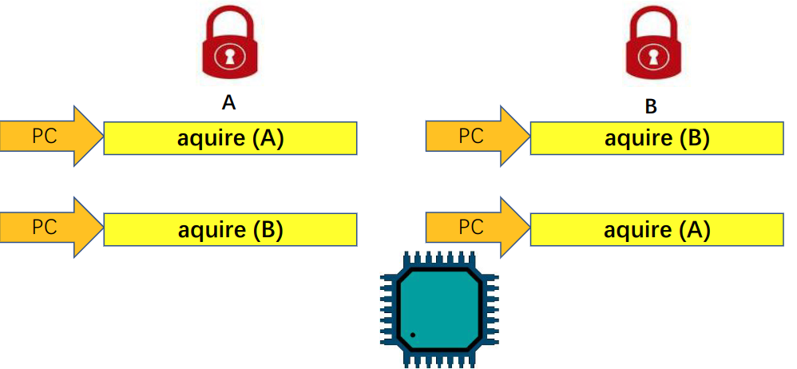

<!-- GFM-TOC -->
- [基本概念](#基本概念)
- [自旋锁](#自旋锁)
- [学习资料](#学习资料)
<!-- GFM-TOC -->
---

## 基本概念
* 并发：多个控制流同时执行
  * 多核处理器多任务
  * 单处理器多任务
  * 单处理器+中断
* 同步：为了保证在并发执行的环境中各个控制流可以有效执行而采用的一种编程技术。
  * 自旋锁
  * 信号量
  * 互斥锁
* 临界区：在并发的程序执行环境中，访问共享资源的**指令片段**。
  * 在并发环境下为了有效控制临界区的执行（同步），我们要做的是当有一个控制流进入临界区时，其他相关控制流必须**等待**。
* 死锁：当控制流执行路径中会涉及多个锁，并且这些控制流执行路径获取（aquire）锁的**顺序不同时**就可能会发生死锁问题。
  * 调整获取（aquire）锁的顺序，譬如保持一致。
  * 尽可能防止任务在持有一把锁的同时申请其它的锁。
  * 尽可能少用锁，尽可能少并发。

  
 

## 自旋锁
* 实现方式：当某一任务给共享资源上锁之后，其他任务将无法进入临界区，访问该共享资源将会失败并会一直等待，直到发现该锁已被打开。
* **读取锁的状态**和**上锁**的操作必须是**原子的**。
  * 当某一任务1进入临界区读取锁的状态时，发现其未上锁，若此时刚好进行线程切换至任务2，任务2也发现锁是开的并上锁，再进入临界区访问共享资源。之后线程切换回任务1时，它会接着之前的步骤进行上锁，从而造成**重复上锁**。
    * 造成这一问题的本质是，锁也是一种共享资源。
  * 使用`amoswap`指令。
    * 将`数值1`与`锁的取指`原子交换，即实现了**读取锁的状态**，也实现了**上锁**。
* 使用自旋锁的**注意事项**：
  * 在自旋锁保护的临界区中不能执行长时间的操作。
  * 在自旋锁保护的临界区中不能主动放弃CPU。
    * 若程序编写错误，很有可能该任务就回不来了，继而无法再获得CPU的控制权。

## 学习资料
1. [[完结] 循序渐进，学习开发一个RISC-V上的操作系统 - 汪辰 - 2021春](https://www.bilibili.com/video/BV1Q5411w7z5?p=24)
2. [RVOS Exercise Notes IV](https://ludi.dev/posts/rvos-exercise-iv/)