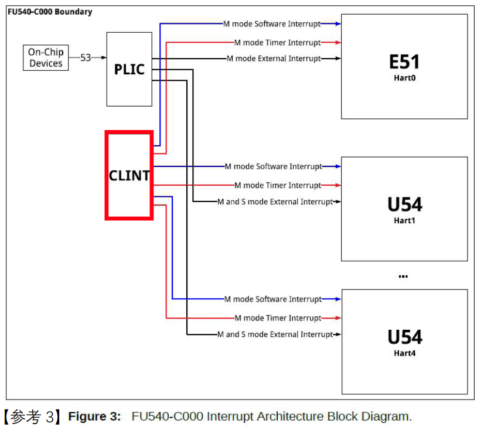

<!-- GFM-TOC -->
- [中断源](#中断源)
- [本地中断 \& CLINT](#本地中断--clint)
- [全局中断 \& PLIC](#全局中断--plic)
- [学习资料](#学习资料)
<!-- GFM-TOC -->
---

## 中断源
* 本地（Local）中断
  * software interrupt
  * timer interrupt
* 全局（Global）中断
  * externel interrupt
  
## 本地中断 & CLINT
* 对于hart来说，PLIC 相当于是一个外设
* 管理本地中断
* 寄存器(**timer**相关)
  * mtime
    * 系统全局唯一，在 RV32 和 RV64 上都是 64-bit。系统必须保证该计数器的值始终按照一个固定的频率递增。
    * 上电复位时，硬件负责将 mtime 的值恢复为 0。 
  * mtimecmp
    * 每个 hart 一个 mtimecmp 寄存器，64-bit。
    * 上电复位时，系统不负责设置 mtimecmp 的初值。
      * 当 mtime >= mtimecmp 时，CLINT 会产生一个 timer 中断。如果要使能该中断需要保证`全局中断打开`并且 `mie.MTIE` 标志位置 1。
      * 当 timer 中断发生时，hart 会设置 `mip.MTIP`，程序可以`在 mtimecmp 中写入新的值清除 mip.MTIP`。
* 寄存器(**software**相关)
  * 每个 Hart 拥有一个 `MSIP` 寄存器。
  * RISCV 规范规定，Machine 模式下的 `mip.MSIP` 对应到一个memory-mapped 的 控制寄存器。为此 QEMU-virt 提供 `MSIP`，该 `MSIP` 寄存器为 32-bit，`高 31 位不可用`，最低位映射到 `mip.MSIP`。
  * 通过对`MSIP`的第0位写1，可以触发`software interrupt`，然后在`软中断函数`中调用`schedule()`，从而实现`兼容协作式多任务`。

  

## 全局中断 & PLIC
* 对于hart来说，PLIC 相当于是一个外设
* 管理外部中断
* Interrupt Source ID 范围：`1 ~ 53（0x35）`，0 预留不用。
* 寄存器
  * Priority
    * 每个 PLIC 中断源对应一个寄存器，用于配置该中断源的优先级。
    * priority越小，优先级越高。
    * priority相同时，ID越小，优先级越高。
  * Pending
    * 每个 PLIC 包含 2 个 32 位的 Pending 寄存器，每一个 bit对应一个中断源。
    * Pending 寄存器中断的 Pending 状态可以通过 claim 方式清除。
  * Enable
    * 每个 Hart 有 2 个 Enable 寄存器 （Enable1 和 Enable2）用于针对该 Hart 启动或者关闭某路中断源。
  * Threhold
    * 每个 Hart 有 1 个 Threshold 寄存器用于设置中断优先级的阈值。
    * 所有小于或者等于（<=）该阈值的中断源即使发生了也会被 PLIC 丢弃。特别地，当阈值为 0 时允许所有中断源上发生的中断；当阈值为 7 时丢弃所有中断源上发生的中断。
  * Claim/Complete
    * Claim 和 Complete 是同一个寄存器，每个 Hart 一个。
    * 对该寄存器执行读操作称之为 Claim，即获取当前发生的最高优先级的中断源 ID。Claim 成功后会清除对应的 Pending 位。
    * 对该寄存器执行写操作称之为 Complete。所谓 Complete 指的是通知 PLIC 对该路中断的处理已经结束。

## 学习资料
1. [[完结] 循序渐进，学习开发一个RISC-V上的操作系统 - 汪辰 - 2021春](https://www.bilibili.com/video/BV1Q5411w7z5?p=21&vd_source=d791a57f43dad7ca6a1d62950cab7001)
2. [RVOS Exercise Notes IV](https://ludi.dev/posts/rvos-exercise-iv/)

