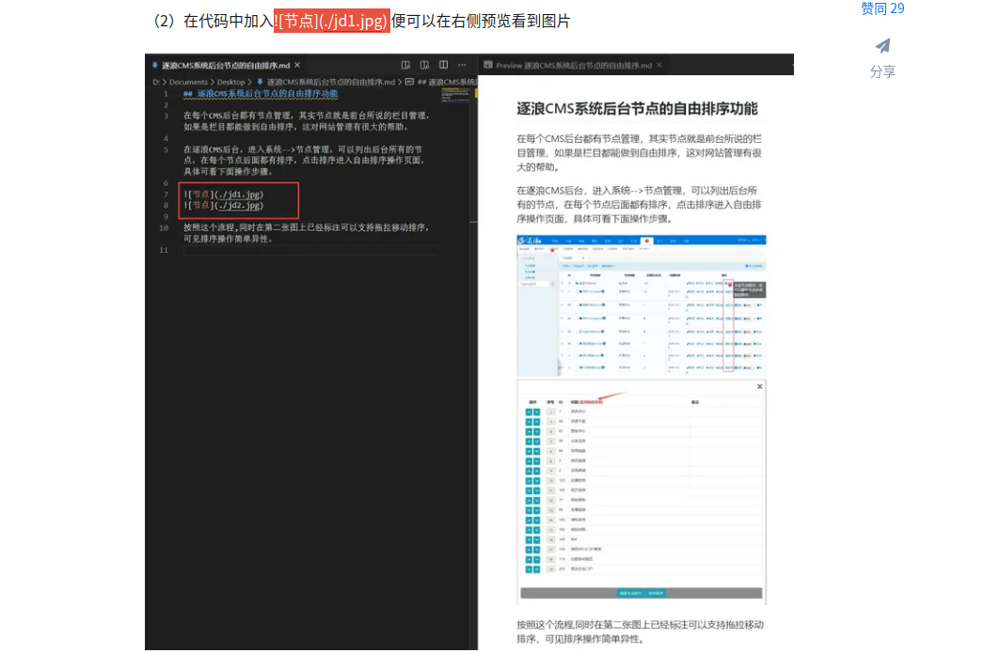

# 一级标题
## 二级标题
### 三级标题
#### 四级标题
##### 五级标题
###### 六级标题


- 无序列表
- 无序列表2

1. 有序列表1
2. 列表2
3. 回车 自动扩展列表
   1. tab 缩进
      1. 二级缩进
         1. bulabula
      2. shift + tab 取消缩进
   

*斜体*

**加粗**

~~删除~~

<u>下划线</u>


部分`高亮`

[网站标题](www.baidu.com)

> 理论知识参考:
> * 《数据结构与算法分析》(C++版) Clifford A. Shaffer
> * 《算法》Robert Sedgewick & Kevin Wayne

---

```
多行文本1
多行文本2
多行文本3
```

```Bash
echo "Hello world!"
```    

```C
#include<stdio.h>int main()
{
   // comments
   return 0;
}
```
---
**插入图片**
<div align="center">  </div>