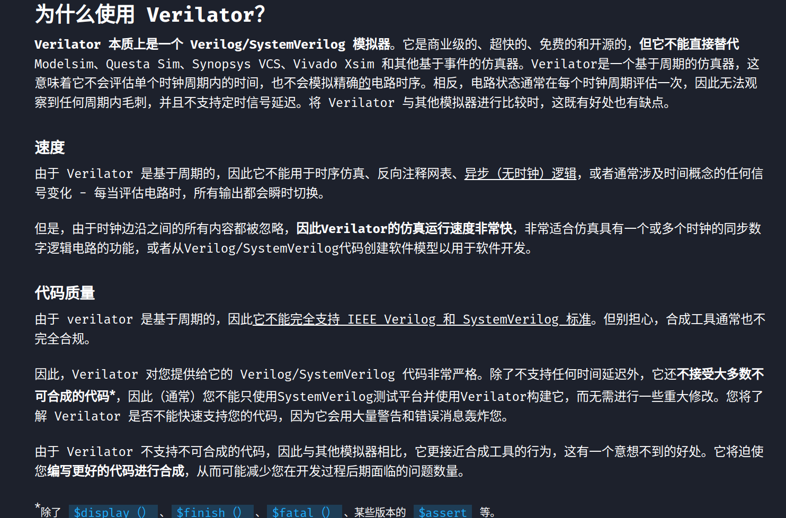

```bash
$ verilator <options> <verilog-file> <cpp-file>
```

- `verilog-file`:需要仿真的 Verilog 文件。
- `cpp-file`:手动编写的 C++ 仿真文件。
- `options`
  - `cc`：指定将 Verilog 代码转化为 C++ 代码；
  - `exe`：告诉Verilator哪个文件是c++仿真文件；
  - `build`：直接编译生成目标文件；
  - `trace`：导出波形文件时需要添加此选项；
  - `top-module` <top-module>：指定 Verilog 顶层模块；
  - `Mdir` <build-dir>：指定生成文件的目录；
  - `CFLAGS` <c-flags>：指定一个 GCC 的编译选项；
  - `I` <include-path>：可以指定一个包含路径。
  - 更多参数细节见：[verilator Arguments](https://verilator.org/guide/latest/exe_verilator.html)


---
- `testbench`在`Verilator`中叫做`wrapper file`
- 编写的.v文件 (如top.v) 会产生仿真中使用的.h文件 (如Vtop.h) 。而 Vtop.h中定义了`Verilated model` : `Vtop* top`。
- `eval()`函数更新电路的状态
- `Verilated::gotFinish(true)`可以终结仿真：[Setting Verilated::gotFinish() to true without $finish #2113](https://github.com/verilator/verilator/issues/2113)
  

---
<div align="center">  