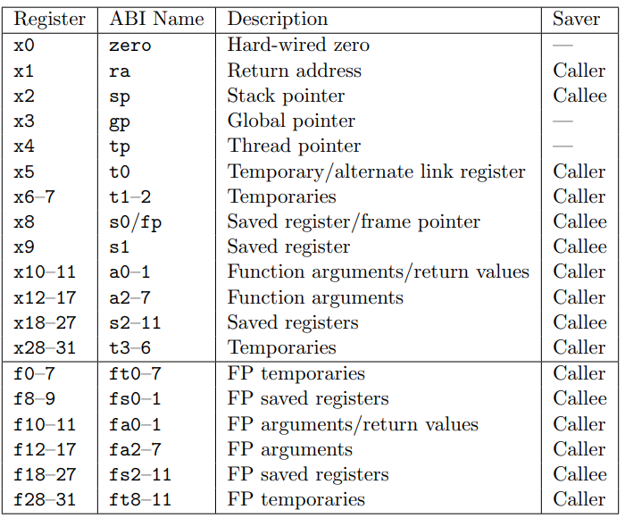
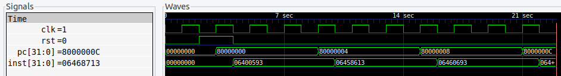

## 学习资料
1. [C/C++ 命令解析：getopt 方法详解和使用示例](https://blog.csdn.net/afei__/article/details/81261879)
1. [riscv交叉编译器版本问题](https://blog.csdn.net/u014558361/article/details/135372254)
1. [谨以此写下本人安装riscv的全过程 简单易懂！！](https://blog.csdn.net/qq_41976613/article/details/89629372)
2. [riscv-gnu-toolchain 交叉编译器如何构建？](https://www.zhihu.com/question/560687334/answer/3281645780?utm_id=0)
3. [RISC-V GNU编译环境搭建与运行实践](https://blog.csdn.net/ALLap97/article/details/112373544)
4. [安装 RISC-V 交叉编译工具链](https://soc.ustc.edu.cn/CECS/lab0/riscv/)
5. [对于RISV -V处理器，详解 gcc 编译器，Makefile中gcc编译器参数的含义_gcc riscv](https://zhuanlan.zhihu.com/p/660618423)
6. [Verilog 有符号数间，及有符号数与常数比较大小](https://blog.csdn.net/sinat_29862967/article/details/119829214)
7. [Verilog算术右移](https://blog.csdn.net/qq_41634276/article/details/80414488) 

---

## Register

  

  